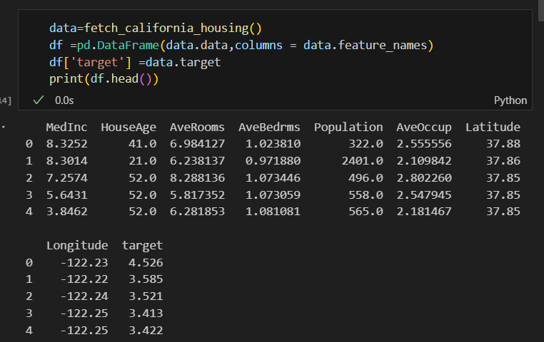
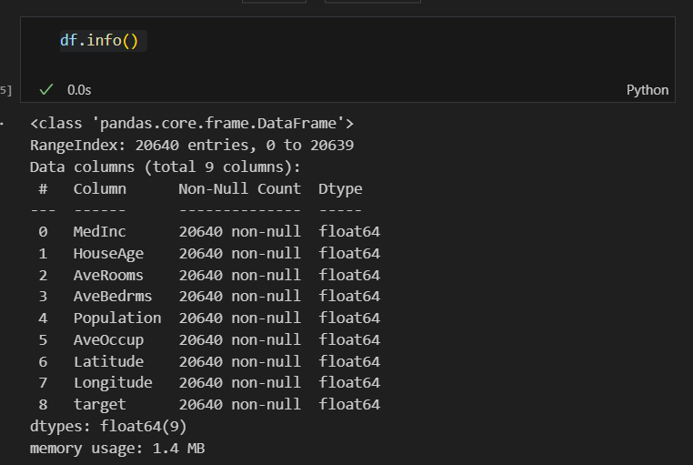
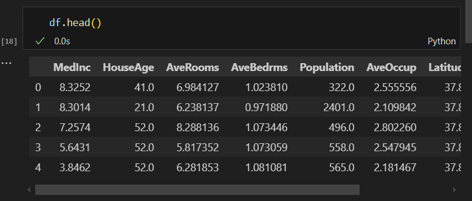
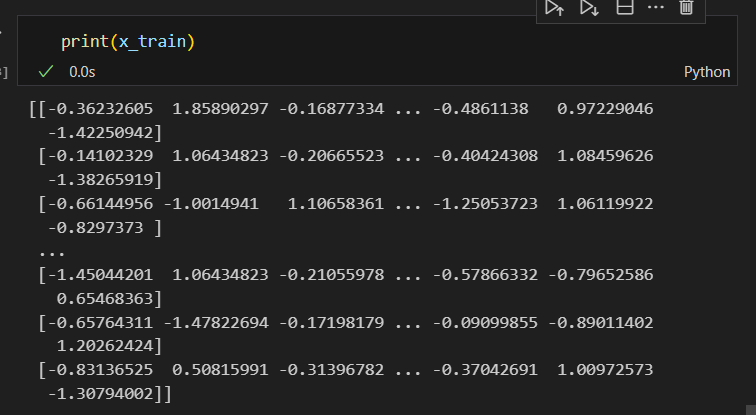
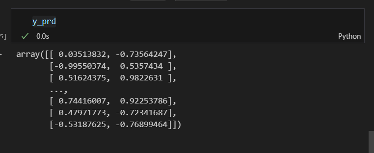
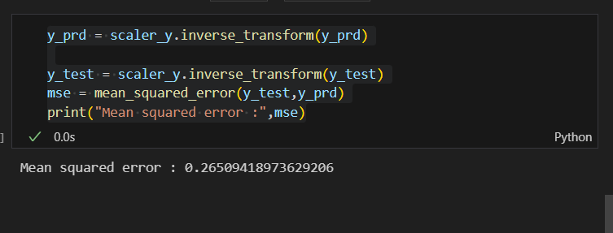

# SGD-Regressor-for-Multivariate-Linear-Regression

## AIM:
To write a program to predict the price of the house and number of occupants in the house with SGD regressor.

## Equipments Required:
1. Hardware – PCs
2. Anaconda – Python 3.7 Installation / Jupyter notebook

## Algorithm
1. Importing necessary liberaries
2. Data preprocessing
3. Spliting data int training and testing data
4. Performing SGD-Regressor
5. Calculating error

## Program:
```
/*
Program to implement the multivariate linear regression model for predicting the price of the house and number of occupants in the house with SGD regressor.
Developed by: Nemaleshwar H
RegisterNumber:  212223230142
*/
```
## importing liberaries

```py
import numpy as np
import pandas as pd
from sklearn.datasets import fetch_california_housing
from sklearn.linear_model import SGDRegressor
from sklearn.model_selection import train_test_split
from sklearn.metrics import mean_squared_error
from sklearn.multioutput import MultiOutputRegressor
from sklearn.preprocessing import StandardScaler

```
## Data Reading

```py
data=fetch_california_housing()
df =pd.DataFrame(data.data,columns = data.feature_names)
df['target'] =data.target
print(df.head())
df.info()
```
## Data Cleaning

```py

Y = np.column_stack((data.target,data.data[:,6]))
X=df.drop(columns=['AveOccup','target'],inplace=False)
df.head()

```
## Splitting data set

```py

x_train,x_test,y_train,y_test =train_test_split(X,Y,test_size=0.2,random_state=1)
x.head(5)
```
## Standard scaller

```py
scaler_x = StandardScaler()
scaler_y = StandardScaler()
def new_func(scaler_x):
    x_train = scaler_x.fit_transform(x_train)

new_func(scaler_x)
x_test = scaler_x.transform(x_test)

y_train = scaler_y.fit_transform(y_train)
y_test = scaler_y.transform(y_test)
```
## SGD Regressor
```py
sgd = SGDRegressor(max_iter=1000,tol=1e-3)
multi_output_sgd =MultiOutputRegressor(sgd)

multi_output_sgd.fit(x_train,y_train)

y_prd= multi_output_sgd.predict(x_test)

y_prd

y_prd = scaler_y.inverse_transform(y_prd)

y_test = scaler_y.inverse_transform(y_test)
mse = mean_squared_error(y_test,y_prd)
print("Mean squared error :",mse)
```
## Output:

## Data



## cleaned Data

 
## scaler


## Predection


## error


## Result:
Thus the program to implement the multivariate linear regression model for predicting the price of the house and number of occupants in the house with SGD regressor is written and verified using python programming.
